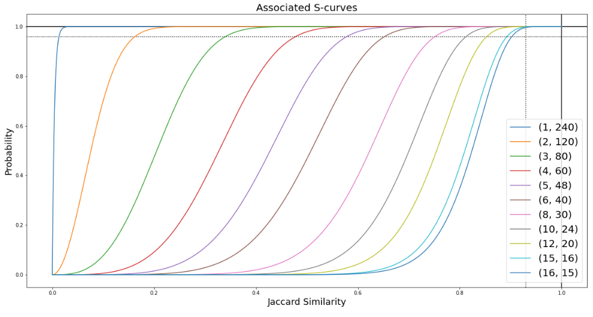

# TextData_Mining_ML
Textual data manipulation projects with applications of advanced data mining techniques: recommendation systems, information retrieval systems, search engines, latent sentiment analysis, pagerank, PCA.

## Brief description
Most of the machine learning algorithms and pattern recognition (data mining) techniques reported are applied on text-based data:
- a book (*Le Morte D'Arthur* by Thomas Malory)
- a collection of information about songs

The code is organized into notebooks; in each jupyter notebook we focused on a particular class of algorithms and models:
>- `code/MINHASH_LSH.ipynb`: near duplicates analysis and detection throuch the using of a particular hashing (similarity based) techniques;
>- `code/latent_sematic_analyisPCA.ipynb`: latent sematic analysis and identification of topics through dimensionality reduction techniques (PCA);
>- `code/my_search_engine.ipynb`: implementation of a complete search engine and analyze its performances through ad hoc evaluation metrics;
>- `code/pagerank.ipynb`: implementation of the famous Pagerank algorithm and its variations like the Topic_sensitive Pagerank and the Personalized Pagerank;
>- `code/recommendation_sys.ipynb`: implementation of a recommendation system through Collaborative Filtering techniques (item-item matrix approach);
>- `code/supervised_ML.ipynb`: use of several machine learning classifiers in a supervised setup and performance comparison.

## Near duplicates detection

The near duplicates detection is a problem which involves the search for similar items (documents in this case) given a query item.

In the `MINHASH_LSH.ipynb` jupyter notebook we proceed with a pipeline typical in data mining and pretty useful when detecting near duplicates and similar documents:

1. SHINGLING  $\rightarrow$ we map the problem of similarity between documents to a problem of finding sets with a relatively large intersection (in this case each document is represented as a set of strings of length $k$, i.e. k-shingles);
2. MINHASHING $\rightarrow$ we compress the large sets from the previous point, hashing them in smaller _signatures_ so that it is still possible to do an estimate of the true **Jaccard similarity**;
3. LOCALLY-SENSITIVE HASHING (LSH) $\rightarrow$ we reduce the computational cost, restricting the search of near duplicates between pairs of hashed documents that are most likely to be similar.

LSH consists in hashing several times a doc s.t. similar docs more likely hash to the same _bucket_ and become _candidate pairs_ (in terms of similarity). 
The explanation of the algorithm is long and tedious but we can say that it involves choosing certain parameters $(r, b)$ to pass to the hashing function, which govern the threshold for determining candidate pairs. There is a trade-off between false positives and false negatives that can be handled by the imposition of an ad hoc threshold. Below we report the probability (for our set of documents) of becoming candidate pairs given their _Jaccard similarity_. 

Among all the configurations we decided to use 
, this one grantees us the smallest amount of False-Negatives and a LSH execution time smaller than the maximum (2 min). With this configuration we'll have a big number of False-Positives, but thanks to the computation of the approximate Jaccard Similarity, we can significantly reduce this number.

## Used technologies

 

## Team
>- [Enrico Grimaldi](https://github.com/Engrima18)
>- [Mario Edoardo Pandolfo](https://github.com/JRhin)
